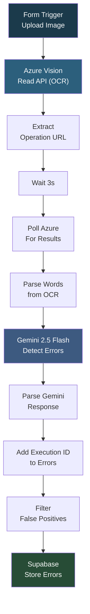

# My Workflow 38

## Overview

A packaging error detection workflow that uses Microsoft Azure Computer Vision for OCR text extraction, then feeds the extracted words to Google Gemini for intelligent spelling and grammar error detection. It uploads an image via a form, sends it to Azure's Read API as binary data, polls for the OCR result, parses all extracted words, and then uses Gemini 2.5 Flash with a detailed prompt to identify genuine spelling errors while ignoring product codes, brand names, and technical specifications. Detected errors are filtered to remove false positives and stored in Supabase.

## How It Works

```
Form (upload image) -> Azure Vision Read API (OCR) -> Extract operation URL -> Wait 3s -> Poll for results -> Parse words from Azure response -> Gemini 2.5 Flash (detect spelling/grammar errors, ignore product codes) -> Parse Gemini response -> Add execution ID -> Filter false positives -> Store in Supabase
```

### Workflow Diagram



## Integrations

- **Microsoft Azure Computer Vision** - OCR text extraction via Read API
- **Google Gemini (2.5 Flash)** - Intelligent error detection with packaging-specific rules
- **Supabase** - Error result storage

## Setup

1. Import `My_workflow_38.json` into your n8n instance.
2. Configure Azure header auth credentials (Ocp-Apim-Subscription-Key).
3. Configure Google Gemini and Supabase credentials.
4. Activate and submit the form with a packaging image.
